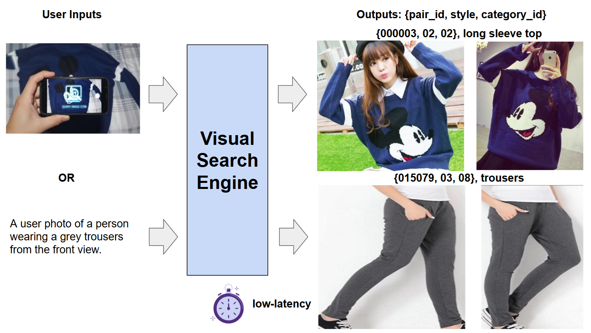
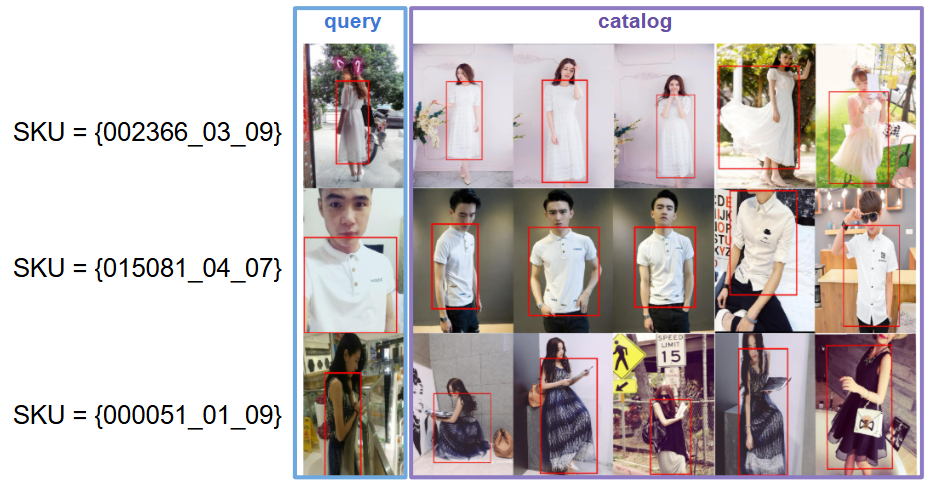
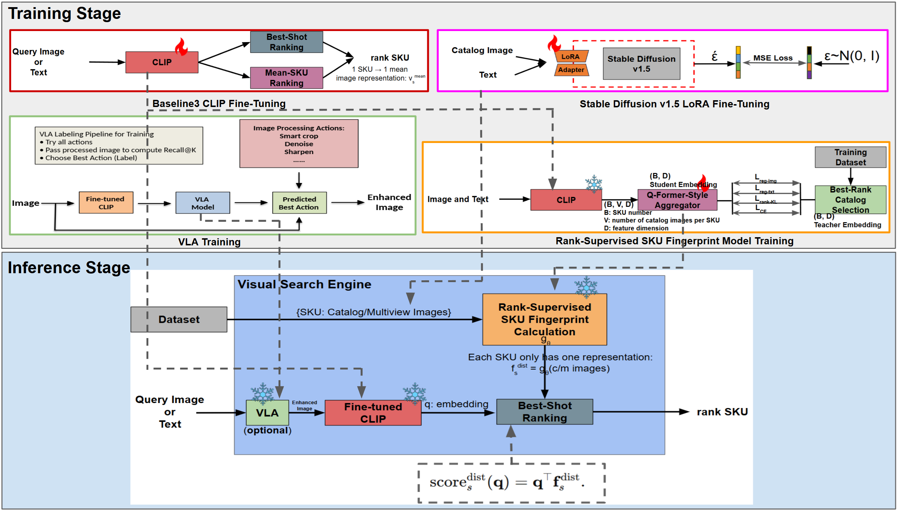
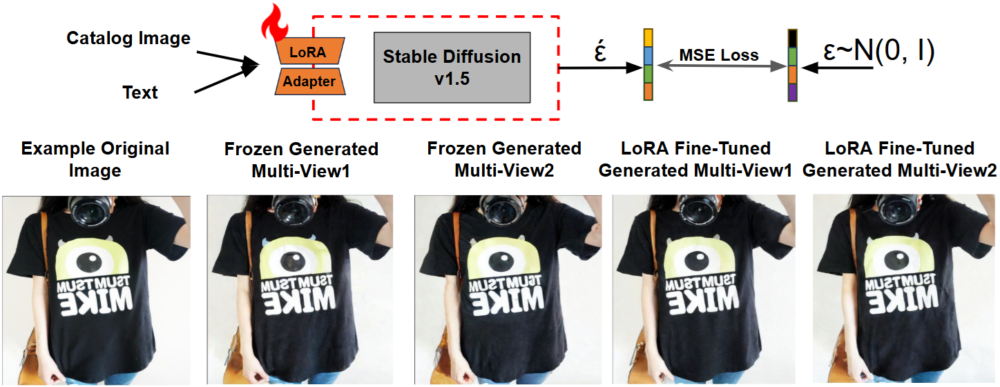
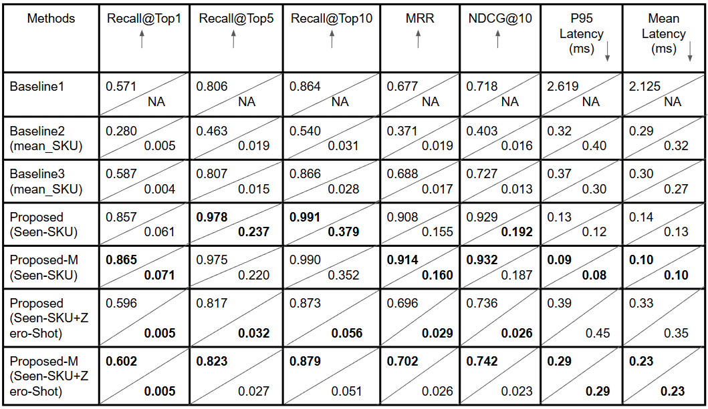
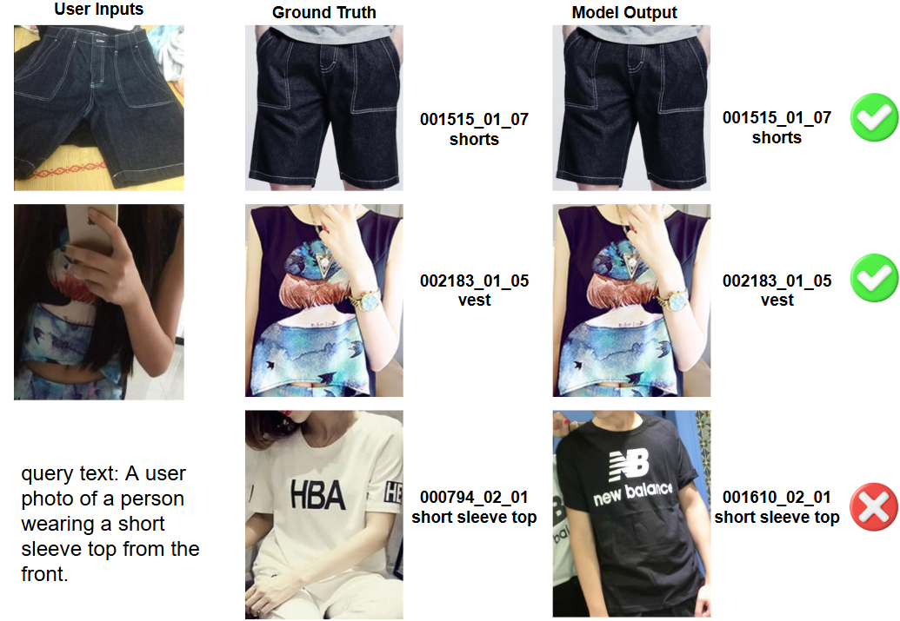

# Rank-Supervised SKU Fingerprints for Low-Latency Generative Visual Search

> **Author**: Patrick Chen  
> **Course**: 10-623 Generative AI, Carnegie Mellon University  
> 📄 [View Project Final Report](./doc/10623_Final_Project_Report.pdf)

This repository implements a production-style fashion visual search system that maps each Stock Keeping Unit (SKU) to **a single shared embedding** (“SKU-per-vector”) used for both image and text queries. The system is built and evaluated on **DeepFashion2** and combines:

- CLIP-based image–text encoders
- A **rank-supervised SKU fingerprint aggregator** (Q-Former-style)
- **Stable Diffusion v1.5 + LoRA** generative multi-view catalog augmentation (offline only)
- An optional **Visual-Language-Action (VLA)** query image pre-processing policy
- Compact dense retrieval over SKU fingerprints with end-to-end CPU latency measured from cosine similarity + reduction-max to final SKU scores

---

## 1. Project Overview

<div align="center">
  
</div>

E-commerce platforms must answer a noisy user image or a short text description with the exact purchasable product under tight latency budgets. We target a **SKU-per-vector** regime:

- A user submits a query image or short text.
- The system computes a query embedding using a fine-tuned CLIP encoder (optionally after VLA pre-processing for images).
- Each SKU is represented by a **single fingerprint vector** distilled from many catalog / generative views.
- Retrieval reduces to a dense cosine-similarity computation between the query embedding and all SKU fingerprints, followed by a simple top‑K on CPU.

---

## 2. Dataset and SKU Definition

We use **DeepFashion2 (DF2)** as the only dataset.

A **visual SKU** is defined as:

$
\text{SKU} = (\text{pair\_id},\ \text{style} > 0,\ \text{category\_id})
$

- Items with `style = 0` are discarded.
- Crops from images with `source = "shop"` are treated as **catalog** images.
- Crops from images with `source = "user"` are treated as **query** images.
- Train / validation / test splits follow DF2 and are disjoint at the SKU level.
- Final statistics: **21,190 SKUs** and **198,140 images** (catalog + user).

<div align="center">
  
</div>

All preprocessing (cropping, SKU grouping, and image–text JSONL generation) is handled by the scripts referenced in `RUN.md` (see Section 6).

---

## 3. Method

### 3.1 End-to-End Pipeline

<div align="center">
  
</div>

**Training stage (top)**

1. **Baseline CLIP fine-tuning (Baseline 3)**  
   - ViT-B/32 CLIP is fine-tuned on DF2 SKU labels for both image and text encoders, using SKU-level cross-entropy loss for images and text.

2. **Stable Diffusion v1.5 LoRA multi-view generation**  
   - Offline SD v1.5 img2img + LoRA produces identity-preserving catalog multi-views.

3. **Rank-supervised SKU fingerprint model**  
   - A Q-Former-style aggregator \(g_\theta\) attends over catalog + generative view embeddings and outputs one L2-normalized fingerprint per SKU.
   - Training uses a combination of:
     - L2 regression to **best-shot teacher** embeddings (selected per SKU from catalog views),
     - KL-based **rank distillation** from teacher rankings (search-metric supervision),
     - Cross-entropy SKU classification over fingerprints.

4. **VLA policy (optional)**  
   - A lightweight policy network takes CLIP visual features + handcrafted quality features and predicts one of several deterministic image-processing actions (crop, denoise, sharpen, exposure adjust, etc.) to maximize downstream retrieval. Labels are generated automatically from which action yields the best Recall@K on training queries.

**Inference stage (bottom)**

- Pre-computed **SKU fingerprints** are stored as a dense embedding matrix.
- Given an image or text query, the system:
  1. (Optionally) applies the VLA-chosen pre-processing to the image.
  2. Encodes the query via fine-tuned CLIP.
  3. Computes cosine similarity between the query embedding and every SKU fingerprint on CPU.
  4. Returns the top-ranked SKUs and representative catalog images.

No approximate nearest-neighbor library (e.g., FAISS) is used; retrieval is a straightforward matrix–vector product plus top‑K.

### 3.2 Generative Multi-View Augmentation

<div align="center">
  
</div>

We LoRA-tune Stable Diffusion v1.5 img2img on a subset of DF2 catalog crops and generate identity-preserving multi-view images by:

1. Conditioning on prompts that describe category, visibility, and a simple studio background.
2. Running img2img with low noise strength.
3. Filtering candidates by CLIP cosine similarity, color distance, and NSFW checks.

These synthetic views expand the set of catalog embeddings used by the aggregator **without increasing online latency**, since generation is fully offline. In the final experiments, we augment up to **5.5k SKUs (~30% of all SKUs)** and observe consistent gains.

---

## 4. Results

### 4.1 Quantitative Results

<div align="center">
  
</div>

Key findings on DeepFashion2 validation (image-to-SKU and text-to-SKU):

- **Image → SKU (Seen+Zero SKUs):**
  - ReID baseline (Baseline 1): **R@1 = 0.571**, p95 = 2.62 ms.
  - Fine-tuned CLIP mean-SKU (Baseline 3): **R@1 = 0.587**, p95 = 0.37 ms.
  - Proposed fingerprint (Seen-SKU): **R@1 = 0.857**, p95 = 0.13 ms.
  - Proposed-M (+ SD multi-view, Seen-SKU): **R@1 = 0.865**, p95 = 0.09 ms.
  - Proposed-M (Seen+Zero SKUs): **R@1 = 0.602**, p95 = 0.29 ms.

- **Text → SKU (Seen-SKU):**
  - Baseline CLIP mean-SKU models are weak under metadata-style prompts (R@1 ≤ 0.005).
  - Proposed fingerprint: **R@1 = 0.061**; Proposed-M: **R@1 = 0.071**, with similar trends for R@5/10 and NDCG@10.

Overall, rank-supervised fingerprints substantially outperform all baselines on image retrieval while offering **lower CPU latency** than both the ReID and CLIP baselines. Multi-view augmentation (Proposed-M) consistently improves Recall@1 and latency by giving the aggregator more pose and background variation while keeping a single fingerprint per SKU.

Latency is measured as **end-to-end query time on CPU**, from query embedding to final ranked SKU list, including cosine similarity against all SKU fingerprints and scatter-style reduction to SKU scores.

### 4.2 Qualitative Results

<div align="center">
  
</div>

- Top rows: successful image → SKU retrieval under significant changes in pose and background.
- Bottom row: text query example where the retrieved SKU is visually plausible but not the exact ground truth, highlighting ambiguity in short metadata-based descriptions.

---

## 5. Repository Layout

A simplified view of the repository structure:

```text
.
├── dataset/
│   ├── build_deepfashion2_sku_crops.py        # DF2 → SKU crops + metadata
│   ├── build_deepfashion2_text_prompts.py     # DF2 → synthetic text prompts
│   └── ...
├── models/
│   ├── clip_sku_baseline.py                   # CLIP / SigLIP-style retrievers
│   ├── sku_fingerprint_student.py             # Q-Former-style SKU aggregator
│   └── reid_resnet50_bnneck.py                # ReID ResNet-50 baseline model
├── VLA_model/                                 # VLA policy + image ops + features
├── train/                                     # (If present) training entry points
│   ├── train_reid_df2.py                      # ReID ResNet-50 baseline model traininer
│   ├── train_clip_sku_df2.py                  # CLIP model fine-tuner
│   ├── train_sku_fingerprint_distill.py       # The SKU fingerprint aggregator trainer
│   ├── train_sd_lora_df2.py                   # The SD v1.5 Img2Img model LoRA fine-tuner
├── eval/
│   ├── eval_reid_df2.py                       # ReID / CLIP evaluation helpers
│   └── eval_sku_fingerprint_student.py        # Main fingerprint evaluation
├── scripts/                                   # Reproduction and experiment scripts
│   ├── prepare_deepfashion2_sku.sh
│   ├── prepare_df2_reid_splits.sh
│   ├── train_baseline1_reid.sh
│   ├── eval_baseline1_reid_val.sh
│   ├── train_clip_sku_df2.sh
│   ├── eval_clip_sku_df2.sh
│   ├── train_sd_lora_df2*.sh
│   ├── gen_sd_aug_df2*.sh
│   ├── gen_bestshot_teachers_df2.sh
│   ├── train_sku_fingerprint_student*.sh
│   ├── eval_sku_fingerprint_student.sh
│   └── eval_sku_fingerprint_student_demo.sh
├── docs/
│   ├── 10623_Final_Project_Report.pdf         # Final project report (see below)
│   └── images/
│       ├── overview_low_latency_visual_search.png
│       ├── df2_sku_examples.png
│       ├── generative_multiview_sd15.png
│       ├── qualitative_results.png
│       ├── quantitative_results.png
│       └── training_inference_pipeline.png
├── RUN.md                                     # Detailed, script-level instructions
└── README.md                                  # This file
```

---

## 6. How to Run (High-Level)

For full details, please see **`RUN.md`**, but the main steps are:

1. **Prepare the SKU dataset**

   ```bash
   ./scripts/prepare_deepfashion2_sku.sh
   ```

   This script:
   - Crops DF2 images by bounding boxes.
   - Groups crops into SKUs.
   - Writes `<split>_sku_metadata.json` and `<split>_image_text*.jsonl`.

2. **Prepare ReID-style splits for Baseline 1 (optional)**

   ```bash
   ./scripts/prepare_df2_reid_splits.sh
   ```

3. **Train baselines**

   - ReID baseline:

     ```bash
     ./scripts/train_baseline1_reid.sh
     ./scripts/eval_baseline1_reid_val.sh
     ```

   - CLIP/SigLIP baselines (Baseline 2 & 3):

     ```bash
     ./scripts/train_clip_sku_df2.sh
     ./scripts/eval_clip_sku_df2.sh
     ```

4. **Train Stable Diffusion LoRA (optional, offline)**

   ```bash
   ./scripts/train_sd_lora_df2.sh <GPU_ID>
   # plus additional variants such as:
   ./scripts/train_sd_lora_df2_ep1.sh <GPU_ID>
   ```

5. **Generate multi-view catalog images (offline)**

   ```bash
   ./scripts/gen_sd_aug_df2_resume.sh <GPU_ID>
   ./scripts/gen_sd_aug_df2_light13k.sh <GPU_ID>
   ./scripts/gen_sd_aug_df2_light5p5k.sh <GPU_ID>
   ./scripts/gen_sd_aug_df2_light3k.sh <GPU_ID>
   # and SD+LoRA variants:
   ./scripts/gen_sd_aug_df2_light5p5k_sdloraftep1.sh <GPU_ID>
   ./scripts/gen_sd_aug_df2_light5p5k_sdloraftep3.sh <GPU_ID>
   ./scripts/gen_sd_aug_df2_light13k_sdloraftep1.sh <GPU_ID>
   ./scripts/gen_sd_aug_df2_light13k_sdloraftep3.sh <GPU_ID>
   ```

6. **Generate teacher embeddings for distillation**

   ```bash
   ./scripts/gen_bestshot_teachers_df2.sh <GPU_ID>
   ```

7. **Train the SKU fingerprint student (aggregator)**

   ```bash
   ./scripts/train_sku_fingerprint_student.sh <GPU_ID>
   ./scripts/train_sku_fingerprint_student_multiview3k.sh <GPU_ID>
   ./scripts/train_sku_fingerprint_student_multiview5p5k.sh <GPU_ID>
   ./scripts/train_sku_fingerprint_student_multiview5p5k_sd1ep.sh <GPU_ID>
   ./scripts/train_sku_fingerprint_student_multiview5p5k_sd3ep.sh <GPU_ID>
   ```

8. **Evaluate distilled SKU fingerprints**

   ```bash
   ./scripts/eval_sku_fingerprint_student.sh <GPU_ID>
   ```

9. **Run the main demo / reproduction script**

   ```bash
   ./scripts/eval_sku_fingerprint_student_demo.sh <GPU_ID>
   ```

   This script loads:
   - Fine-tuned CLIP checkpoint (Baseline 3),
   - Student aggregator weights,
   - (Optionally) VLA policy weights,

   and evaluates the system on DeepFashion2 validation, reporting image and text retrieval metrics and latency.

---

## 7. Final Project Report

The full paper-style report (12 pages) is included in the repository:

- **Path:** `docs/10623_Final_Project_Report.pdf`  
- **Recommended citation/title:**  
  *Patrick Chen, Mingyang Yu, Kanlong Ye. “Rank-Supervised SKU Fingerprints for Low-Latency Generative Visual Search.” 10-423/623/723 Generative AI Final Report, Carnegie Mellon University, 2025.*

You can open it directly from the repo root:

```bash
open docs/10623_Final_Project_Report.pdf   # macOS
xdg-open docs/10623_Final_Project_Report.pdf  # Linux
```

---

## 8. Acknowledgements and License

This codebase was developed as a course project for **10-423/623/723 Generative AI at CMU** and is intended for research and educational use only.

- Please check the **DeepFashion2** dataset license before using the data for any non-academic purpose.
- Respect the licenses of any pretrained models used (CLIP, Stable Diffusion v1.5, etc.).
- If you build on this repository in academic work, please cite the final project report and the original DeepFashion2 and CLIP papers.
